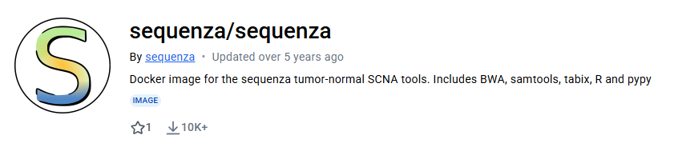

# Sequenza Automation

# Manual로 작업 수행하기

```bash
conda activate sequenza - sequenza 실행을 위한 env activation
sequenza-utils gc_wiggle -w 50 --fasta human_g1k_v37.fasta -o human_g1k_v37.wig.gz (/data/SJ/projects/flagship_figure/gc_wiggle/human_g1k_v37.wig.gz)
sequenza-utils bam2seqz -n normal.bam -t tumor.bam --fasta human_g1k_v37.fasta -gc human_g1k_v37.wig.gz -o out.seqz.gz
sequenza-utils seqz_binning --seqz out.seqz.gz -w 50 -o out small.seqz.gz
Rscript /data/SJ/projects/flagship_figure/ext_11a/scripts/run_sequenza.R -i small.seqz.gz -o output_dir -n sample_name
```

# Automation Pipeline

## 개발 목적

- Sequenza 환경으로 인한 문제
    - 해당 Tool의 경우, R과 Python을 모두 사용하도록 설계되어 있는데, 이 때 두 Tool의 개별적인 환경과 더불어 R과 Python 간의 버전이 맞아야 함도 고려되어야 함.
- 많은 샘플에 대해 분석을 수행하고자 함.
    - Clone 샘플에 대한 분석을 하고자 했을 때, 개수가 많다 보니 이를 위한 자동화가 필요하다고 생각하였음.
- Flagship Figure 작성 시, Sequenza에 대한 분석 결과 파일이 필요.

## 개발 과정

- Snakemake를 통한 자동화
- Dockerhub에서 배포 중인 공식 Image를 통하여 환경 의존성 / 호환 문제를 최소화
    
    
    
- 필요 환경에 대한 Container로 동작하도록 하여 Cloud 환경에 올려도 발생할 수 있는 문제를 최소화 하였음.

# 파일 경로
# 📂 Pipeline Path
**`/data/SJ/pipeline/sequenza_pipeline`**  
👉 곧 GitHub 백업 후 연구실 메인 디렉토리로 이관 예정

```
sequenza_pipeline/
├── Snakefile
├── bin/
│   ├── benchmarks_summary.py   # 실행 시간, CPU 사용량 계산 스크립트
│   ├── config.py               # Pipeline 실행 관련 Config 로드 스크립트
│   └── run_sequenza.R          # Sequenza 실행용 R 스크립트
├── envs/
│   └── cluster.json            # cluster 환경 구성 (현재는 미사용)
├── modules/
│   └── sequenza.snakefile      # Sequenza Rule 정의
└── refs/
    └── ref.yaml                # Reference Genome 경로 (현재 GRCh37, 추후 GRCh38 추가 예정)
```

---

# 📂 Analysis Path
**`/data/SJ/projects/flagship_figure/analysis_pipeline`**  
👉 곧 GitHub 백업 후 연구실 메인 디렉토리로 이관 예정

```
analysis_pipeline/
├── analysis/
│   └── 10_post_rt_leg_fb_3-2/           # 예시 샘플명
│       ├── output/                      # 최종 결과물
│       │   ├── *_CN_bars.pdf
│       │   ├── *_CP_contours.pdf
│       │   ├── *_alternative_fit.pdf
│       │   ├── *_alternative_solutions.txt
│       │   ├── *_chromosome_depths.pdf
│       │   ├── *_chromosome_view.pdf
│       │   ├── *_confints_CP.txt
│       │   ├── *_gc_plots.pdf
│       │   ├── *_genome_view.pdf
│       │   ├── *_model_fit.pdf
│       │   ├── *_mutations.txt
│       │   ├── *_segments.txt
│       │   ├── *_sequenza_cp_table.RData
│       │   ├── *_sequenza_extract.RData
│       │   └── *_sequenza_log.txt
│       └── seqz/                        # 중간 생성물
│           ├── *.seqz.gz
│           ├── *.seqz.gz.tbi
│           ├── *.small.seqz.gz
│           └── *.small.seqz.gz.tbi
├── benchmarks/                           # 실행 성능 기록
│   ├── sqnz.bam2seqz.<샘플>.txt
│   ├── sqnz.binning.<샘플>.txt
│   └── sqnz.run.<샘플>.txt
├── logs/                                 # 실행 로그
│   ├── sqnz.bam2seqz.<샘플>.err
│   ├── sqnz.bam2seqz.<샘플>.out
│   ├── sqnz.binning.<샘플>.err
│   ├── sqnz.binning.<샘플>.out
│   ├── sqnz.run.<샘플>.err
│   └── sqnz.run.<샘플>.out
├── pipeline.cmd.sh                       # 실행 트리거 스크립트
└── samples.config.yaml                   # 실행에 필요한 Config
```

    
# 실행 방법
    
   1. 특정 위치에 분석에 필요한 폴더를 생성합니다. 분석이 실행될 폴더
   2. Sequenza 수행에 필요한 Normal / Tumor Bam 파일을 준비합니다. ***(Tumor Only로는 동작하지 않습니다.)***
   3. samples.config.yaml 파일을 복사하여, 아래와 형식에 맞춰 수정합니다.
        
        ```yaml
        samples:
          {sample_id}: #샘플명이 들어갈 위치 입니다.
            normal_bam: {normal_bam_file_path} #normal bam 파일에 대한 경로가 입력될 위치 입니다.
            tumor_bam: {tumor_bam_file_path} #tumor bam 파일에 대한 경로가 입력될 위치 입니다.
          10_post_rt_leg_fb_3-2: (예시)
            normal_bam: /data/temp_intern/intern/woo/flagship_figure/bam/DB10/10_PRL3-1_001B8-E10.s.md.ir.bam
            tumor_bam: /data/temp_intern/intern/woo/flagship_figure/bam/DB10/10_post_rt_leg_fb_3-2.s.md.ir.bam
        ```
        
   4. pipline.cmd.sh 파일을 복사하여, 아래와 같이 수정합니다.
        
        ```bash
        wkdir="/data/SJ/projects/flagship_figure/analysis_pipeline" #분석이 진행될 경로 - 수정 필요
        conffn="/data/SJ/projects/flagship_figure/analysis_pipeline/samples.config.yaml" #앞서 작성한 config 파일이 위치한 경로 - config와 분석 진행 경로가 달라도 무방합니다. - 수정 필요
        
        mkdir -p ${wkdir}/logs
        
        #일반적 경우 하기 부분 수정할 필요 없음.
        cmd="snakemake \
            --cores all \
            --jobs 10
            --printshellcmds \
            --snakefile /data/SJ/pipeline/sequenza_pipeline/Snakefile \
            --config 'ref=/data/SJ/pipeline/sequenza_pipeline/refs/ref.yaml' \
            --max-jobs-per-second 5 \
            --configfile ${conffn} \
            --directory ${wkdir} \
            --executor slurm --default-resources slurm_account=pipeline slurm_partition=cpu --slurm-init-seconds-before-status-checks=60 \
            --use-singularity \
            --singularity-args '--bind /data,/tmp'"
        echo $cmd
        ```
        
   5. conda activate snakemake : snakemake 실행에 필요한 conda 환경 activate
   6. bash pipline.cmd.sh | /bin/bash : bash shell 실행 후, 출력되는 스크립트 확인 후 | /bin/bash로 실제 실행할 것.

# 실행 화면


- 실행 시, 다음과 같이 현재 지정되어 있는 config / file_path에 대해서 출력 후 진행.
- 샘플명 등이 잘못되지 않았는지 마지막으로 한 번 더 확인할 것.
- squeue를 사용하여 작업 확인 시, 위 SLURM run ID를 참조할 것.
